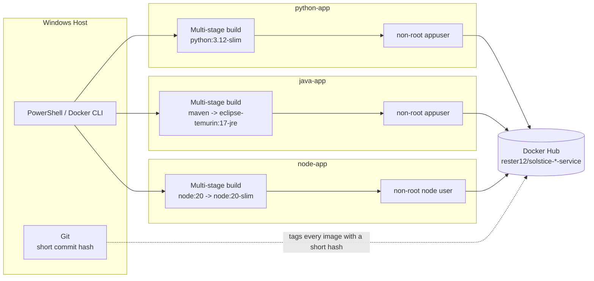

# Containerizing Java, Python, and JavaScript Apps - Multi-Stage Docker Builds, Non-Root Users, and Docker Hub Tagging

## Overview

This project containerizes three small internal tools, one Python service, one Java service, and one Node/JavaScript service, each from scratch, starting with a simple single-stage Dockerfile and ending with a hardened, production-leaning image. Every image is versioned and pushed to a public Docker Hub repository rather than left local, and the project deliberately layers in the practices that separate a working Dockerfile from a defensible one: `.dockerignore` build-context hygiene, multi-stage builds to shrink final image size, a real semantic-version-plus-commit-hash tagging convention simulating a CI pipeline, and non-root users in every final image.

## Medium Article

A detailed Medium walkthrough documenting the complete build process, screenshots, troubleshooting, validation steps, engineering decisions, and lessons learned is available here:

[Containerizing Java, Python, and JavaScript Apps - Multi-Stage Docker Builds, Non-Root Users, and Docker Hub Tagging](#)

## Architecture



Each language track is independent end to end, its own Dockerfile, its own build, its own push, but all three converge on the same tagging convention and the same Docker Hub account, so a teammate pulling any of the three images gets a consistent, predictable experience.

## Technologies Used

- Docker Desktop, Docker Engine, and CLI
- Python 3.12 and FastAPI
- Java 17, Spring Boot, and Maven
- Node.js 20 and NestJS
- Multi-stage Docker builds
- Docker Hub as the image registry
- Git, for generating short commit hashes used in image tags
- Windows PowerShell
- Git and GitHub

## Project Objectives

The project objectives were to:

- Write a Dockerfile for a simple Python service, build and run it, confirm it responds on its mapped port, and push the image to a public Docker Hub repository with a real version tag rather than `latest`
- Repeat the process for a Java service and a Node/JavaScript service, choosing an appropriate base image for each, and push both to Docker Hub with meaningful tags
- Add a `.dockerignore` to each of the three projects and compare image sizes before and after to confirm it actually shrinks the build context and, where relevant, the final image
- Convert all three Dockerfiles to multi-stage builds and document the resulting size reduction for each
- Establish a single tagging convention, a semantic version plus a short commit hash, and simulate a CI pipeline's build-once-tag-twice-push-twice flow for all three images
- Add a non-root `USER` to each of the three final Dockerfiles and confirm all three containers actually run without root privileges

## Repository Contents

```
docker-dockerfiles-java-python-js/
|-- python-app/
|   |-- main.py
|   |-- requirements.txt
|   |-- Dockerfile
|   `-- .dockerignore
|-- java-app/
|   |-- pom.xml
|   |-- src/
|   |   `-- main/java/com/solsticedevs/java_app/
|   |-- Dockerfile
|   `-- .dockerignore
|-- node-app/
|   |-- package.json
|   |-- src/
|   |-- Dockerfile
|   `-- .dockerignore
|-- README.md
`-- .gitignore
```

Screenshots documenting each phase are included in the accompanying Medium article rather than this repository.

## Business Scenario

Solstice Devs, a small consultancy, has three internal tools that each currently only run on one developer's laptop, one written in Python, one in Java, and one in Node. Before any of them can be handed off to another teammate or deployed anywhere else, they need to be containerized, versioned, and published somewhere the rest of the team can reliably pull them from.

## Phase 1: Python Service - Dockerfile, Build, and Docker Hub Push

The Python tool was rebuilt as a small FastAPI service with a root endpoint and a `/health` endpoint, chosen over Flask specifically for its interactive, auto-generated Swagger documentation at `/docs`, a stronger visual result for the same amount of work. The first Dockerfile was intentionally simple, a single stage:

```dockerfile
FROM python:3.12-slim
WORKDIR /app
COPY requirements.txt .
RUN pip install --no-cache-dir -r requirements.txt
COPY . .
EXPOSE 8000
CMD ["uvicorn", "main:app", "--host", "0.0.0.0", "--port", "8000"]
```

```bash
docker build -t solstice-python-service:1.0.0 .
docker run -d -p 8000:8000 --name solstice-python-service solstice-python-service:1.0.0
```

With the container running, both endpoints and the Swagger UI were confirmed in the browser, then the image was tagged and pushed to a public Docker Hub repository with a real version tag rather than `latest`:

```bash
docker tag solstice-python-service:1.0.0 rester12/solstice-python-service:1.0.0
docker push rester12/solstice-python-service:1.0.0
```

## Phase 2: Java Service - Dockerfile, Build, and Docker Hub Push

The Java tool was scaffolded as a Spring Boot application via Spring Initializr (Maven, Java 17, Spring Web), with a `HelloController` exposing the same root and `/health` shape as the Python service. Its first Dockerfile ran the full Maven build inside a single `maven` image:

```dockerfile
FROM maven:3.9-eclipse-temurin-17
WORKDIR /app
COPY pom.xml .
COPY src ./src
RUN mvn clean package -DskipTests
EXPOSE 8080
CMD ["sh", "-c", "java -jar target/*.jar"]
```

## Troubleshooting: A UTF-8 BOM Silently Broke the Java Build

The first attempt to build this image failed with `illegal character: ''` on the very first line of `HelloController.java`, a file that, to the eye, looked completely normal. The cause was `Set-Content -Encoding utf8` in Windows PowerShell 5.1, which writes a UTF-8 byte-order mark (BOM) at the start of the file. Java's compiler treats that invisible BOM as an illegal character and refuses to compile the file, which surfaced as a Maven build failure inside `docker build` rather than as an obvious source-code problem. The fix was to rewrite the file with `-Encoding ascii` instead, safe here since the source is plain ASCII, and to adopt that as a standing rule for every `.java`, `.py`, and `.ts` file written this way for the rest of the project.

Once rebuilt, the container was run and verified the same way as Python, then tagged and pushed:

```bash
docker build -t solstice-java-service:1.0.0 .
docker run -d -p 8080:8080 --name solstice-java-service solstice-java-service:1.0.0
docker tag solstice-java-service:1.0.0 rester12/solstice-java-service:1.0.0
docker push rester12/solstice-java-service:1.0.0
```

## Phase 3: Node Service - Dockerfile, Build, and Docker Hub Push

The Node tool was scaffolded with NestJS (ESM modules and Vitest, over CommonJS and Jest) rather than a bare Express app, again favoring the more standout, more structured option. Its first Dockerfile installed dependencies, built the TypeScript output, and ran the compiled JavaScript directly:

```dockerfile
FROM node:20
WORKDIR /app
COPY package*.json ./
RUN npm install
COPY . .
RUN npm run build
EXPOSE 3000
CMD ["node", "dist/main.js"]
```

```bash
docker build -t solstice-node-service:1.0.0 .
docker run -d -p 3000:3000 --name solstice-node-service solstice-node-service:1.0.0
```

The very first attempt to run this container produced no container at all, not even one in an exited state, `docker ps -a` showed nothing and `docker logs` reported no such container existed. Retrying the identical `docker run` command with no changes succeeded on the second attempt, with the container coming up cleanly and Nest's startup logs confirming both routes mapped. The root cause was never conclusively identified, most likely a transient Docker Desktop hiccup, but it's a real troubleshooting moment worth documenting rather than smoothing over. Once running and verified, the image was tagged and pushed the same way as the other two:

```bash
docker tag solstice-node-service:1.0.0 rester12/solstice-node-service:1.0.0
docker push rester12/solstice-node-service:1.0.0
```

## Phase 4: .dockerignore and Build Context Size Comparisons

A `.dockerignore` was added to each project, but whether it actually changes anything depends entirely on how the Dockerfile copies files in. The Java Dockerfile only ever runs `COPY pom.xml .` and `COPY src ./src`, so its `.dockerignore` made almost no measurable difference, there was nothing extraneous being copied in the first place. Python and Node's Dockerfiles both use a blanket `COPY . .`, so their `.dockerignore` files were tested against a more realistic scenario: a Python virtual environment folder and Node's own `node_modules`/`dist` output were present in the build context, and the before/after comparison showed a real, meaningful reduction in build context size once excluded.

```
python-app/.dockerignore
__pycache__/
*.pyc
.venv/
venv/
.git/
.gitignore
.vscode/
.idea/
*.md
```

```
node-app/.dockerignore
node_modules/
dist/
.git/
.vscode/
.idea/
*.md
npm-debug.log
```

```
java-app/.dockerignore
target/
.git/
.idea/
*.iml
.mvn/
mvnw
mvnw.cmd
```

## Phase 5: Multi-Stage Builds and Size Reduction

All three Dockerfiles were converted to multi-stage builds, a build stage that installs dependencies and compiles the application, and a slim runtime stage that copies over only the finished artifact.

**Python** (builder installs dependencies to a user site-packages directory; runtime copies just that directory and the source):

```dockerfile
FROM python:3.12-slim AS builder
WORKDIR /app
COPY requirements.txt .
RUN pip install --no-cache-dir --user -r requirements.txt

FROM python:3.12-slim
WORKDIR /app
COPY --from=builder /root/.local /root/.local
COPY . .
ENV PATH=/root/.local/bin:$PATH
EXPOSE 8000
CMD ["uvicorn", "main:app", "--host", "0.0.0.0", "--port", "8000"]
```

**Java** (builder runs the full Maven build; runtime is a bare JRE image holding only the built JAR):

```dockerfile
FROM maven:3.9-eclipse-temurin-17 AS builder
WORKDIR /app
COPY pom.xml .
COPY src ./src
RUN mvn clean package -DskipTests

FROM eclipse-temurin:17-jre
WORKDIR /app
COPY --from=builder /app/target/*.jar app.jar
EXPOSE 8080
CMD ["java", "-jar", "app.jar"]
```

This one produced by far the largest size reduction of the three, swapping an entire Maven-plus-JDK toolchain for a bare JRE runtime is a categorically different image, not just a trimmed one.

**Node** (builder installs all dependencies and runs the build; runtime installs only production dependencies and copies the compiled output):

```dockerfile
FROM node:20 AS builder
WORKDIR /app
COPY package*.json ./
RUN npm install
COPY . .
RUN npm run build

FROM node:20-slim
WORKDIR /app
COPY package*.json ./
RUN npm install --omit=dev
COPY --from=builder /app/dist ./dist
EXPOSE 3000
CMD ["node", "dist/main.js"]
```

Each was rebuilt and tagged `2.0.0`, and `docker images` confirmed a real size drop against each service's `1.0.0` single-stage tag.

## Single-Stage vs. Multi-Stage Builds

A single-stage build keeps every tool used to build the application, compilers, package managers, build caches, in the final image, whether or not the running application ever needs them again. A multi-stage build splits that into two images: a builder stage that's thrown away once it's done its job, and a runtime stage that copies over only the finished artifact. The application behaves identically either way; what changes is everything the image is carrying that it doesn't actually need to run, which is exactly what a smaller attack surface and a faster `docker pull` both depend on.

## Phase 6: Tagging Convention and a Simulated CI Push Flow

With all three services on solid multi-stage Dockerfiles, a real tagging convention was established: every image gets tagged with both a semantic version (`2.0.0`) and a short Git commit hash, mirroring what an actual CI pipeline would do on every merge to main. A Git repository was initialized at the project root to produce a real commit hash rather than a placeholder:

```bash
git init
git add .
git commit -m "Initial commit: Dockerfiles for Python, Java, and Node services"
git rev-parse --short HEAD
```

Each image was then built once and tagged twice, then both tags pushed, simulating the build-once, tag-twice, push-twice pattern a CI pipeline runs on every release:

```bash
# Python
docker tag solstice-python-service:2.0.0 rester12/solstice-python-service:2.0.0
docker tag solstice-python-service:2.0.0 rester12/solstice-python-service:<short-hash>
docker push rester12/solstice-python-service:2.0.0
docker push rester12/solstice-python-service:<short-hash>

# Java
docker tag solstice-java-service:2.0.0 rester12/solstice-java-service:2.0.0
docker tag solstice-java-service:2.0.0 rester12/solstice-java-service:<short-hash>
docker push rester12/solstice-java-service:2.0.0
docker push rester12/solstice-java-service:<short-hash>

# Node
docker tag solstice-node-service:2.0.0 rester12/solstice-node-service:2.0.0
docker tag solstice-node-service:2.0.0 rester12/solstice-node-service:<short-hash>
docker push rester12/solstice-node-service:2.0.0
docker push rester12/solstice-node-service:<short-hash>
```

All three Docker Hub repositories were checked directly in the browser to confirm both tags actually appeared, not just to trust the CLI's success output.

## Phase 7: Non-Root Users

The final requirement was to run all three containers as a non-root user rather than the default root, meaningfully reducing what an attacker gains if they were ever able to execute code inside one of these containers. Python and Java both needed a user created explicitly, since their base images don't ship with one:

```dockerfile
# python-app/Dockerfile (runtime stage, excerpt)
RUN useradd --create-home --shell /bin/bash appuser
COPY --from=builder /root/.local /home/appuser/.local
COPY . .
RUN chown -R appuser:appuser /app
ENV PATH=/home/appuser/.local/bin:$PATH
USER appuser
```

```dockerfile
# java-app/Dockerfile (runtime stage, excerpt)
RUN useradd --create-home --shell /bin/bash appuser
COPY --from=builder /app/target/*.jar app.jar
RUN chown appuser:appuser app.jar
USER appuser
```

Node's official images are the exception, `node:20-slim` already ships with a built-in `node` user, so the runtime stage only needed to hand that existing user ownership of the app directory:

```dockerfile
# node-app/Dockerfile (runtime stage, excerpt)
RUN chown -R node:node /app
USER node
```

## Troubleshooting: A PowerShell Here-String Silently Truncated the Container's PATH

Writing the Python Dockerfile's `ENV PATH=/home/appuser/.local/bin:$PATH` line through a double-quoted PowerShell here-string (`@"..."@`) caused PowerShell itself to interpolate `$PATH` as an empty PowerShell variable before the file was ever written, silently truncating the line to `ENV PATH=/home/appuser/.local/bin:` with nothing after the colon. That wiped out `/usr/bin`, `/bin`, and every other standard system path from the container, breaking even basic commands like `whoami` and `id` inside it, with no error at build time at all, only once the container was already running. The fix was to switch to a single-quoted here-string (`@'...'@`), which writes its contents literally with no PowerShell interpolation. Every Dockerfile line written through a PowerShell here-string that contains a literal `$` now goes through the single-quoted form as a standing rule.

Each image was rebuilt and tagged `3.0.0`, run, and verified from inside the container:

```bash
docker exec solstice-python-service whoami
docker exec solstice-python-service id
```

All three returned their non-root user (`appuser` for Python and Java, `node` for Node) rather than `root`, confirming the final requirement of the project.

## Validation

Every claim in this project was confirmed by direct observation inside a running container, not by assuming a Dockerfile's intent matched its actual behavior:

- **Basic functionality:** each service's root and `/health` endpoints, and Python's Swagger UI, were confirmed reachable in the browser after every rebuild.
- **Docker Hub publishing:** each repository's tags page was checked directly in the browser after every push, not just the CLI's success message.
- **Build context reduction:** `.dockerignore` was proven to matter only where the Dockerfile actually uses a blanket `COPY . .`; Python and Node both showed a real size drop with a populated virtual-environment or `node_modules` directory present, while Java's explicit `COPY` pattern showed why the same fix doesn't help every project equally.
- **Multi-stage size reduction:** `docker images` was used to directly compare each service's `1.0.0` single-stage tag against its `2.0.0` multi-stage tag, with Java showing the largest reduction of the three.
- **Non-root execution:** `docker exec ... whoami` and `docker exec ... id` were run against all three running `3.0.0` containers, confirming each responded with its intended non-root user rather than root.

## Engineering Decisions

- **FastAPI, Spring Boot, and NestJS over their simpler alternatives.** Flask, a plain runnable JAR, and a bare Express app would all have satisfied the brief technically; FastAPI's interactive Swagger docs, Spring Boot's structure, and NestJS's opinionated architecture were chosen instead specifically because they produce a stronger, more standout result for the same underlying requirement.
- **A single tagging convention across all three languages.** Rather than let each service's tags drift toward whatever felt convenient in the moment, every image follows the same semantic-version-plus-short-commit-hash pattern, which is what makes a `docker pull` of any of the three services predictable to a teammate who's never touched this project before.
- **Multi-stage builds for all three, not just the one with the biggest win.** Java's reduction was the most dramatic, but Python and Node were converted too, since the underlying principle, don't ship build tooling you don't need at runtime, applies regardless of how large the number ends up being.
- **A non-root user in every final image, not just the ones with an obvious existing user.** Node's built-in `node` user made that service trivial; Python and Java both required creating a user explicitly, which was done rather than skipped just because it took more Dockerfile lines.

## Security and Operational Considerations

- **Running as a non-root user limits blast radius.** If an attacker ever achieved code execution inside one of these containers, for example through a vulnerable dependency, a non-root user significantly limits what they can do inside that container compared to root.
- **Multi-stage builds shrink the attack surface, not just the download size.** A build stage's compilers, package managers, and build caches are real, potentially exploitable software; a runtime image that never ships them can't be attacked through them.
- **Version tags over `latest` everywhere.** Every image was pushed with a real semantic version and a commit-hash tag; `latest` was never relied on, so a teammate pulling any of these images always knows exactly which build they're running.
- **A UTF-8 BOM and a PowerShell here-string both produced silent failures, not loud ones.** Both of this project's most significant troubleshooting moments, the Java compile failure and the truncated container PATH, were caused by an invisible character or a silent interpolation rather than an obvious typo, a reminder that tooling defaults on Windows deserve deliberate attention rather than being assumed safe.

## Lessons Learned

- A `.dockerignore` file's actual impact depends entirely on how the Dockerfile copies files in; a Dockerfile using explicit, narrow `COPY` instructions gets little benefit from one, while a Dockerfile using a blanket `COPY . .` can see a real difference the moment anything extraneous, a virtual environment, `node_modules`, is present in the build context.
- Multi-stage builds aren't a uniform win across languages; Java's toolchain-heavy build stage made its reduction dramatic, while Python and Node's builder stages were already fairly lean, producing a smaller but still real improvement.
- PowerShell's `-Encoding utf8` writing a UTF-8 BOM, and a double-quoted here-string silently interpolating a literal `$` in a Dockerfile, are the same underlying category of problem: a Windows text-writing default doing something invisible that only surfaces much later, once, as a compiler error, and once, as a broken PATH inside a running container.
- Simulating a real CI tagging convention by hand, build once, tag twice, push twice, made it clear why CI pipelines automate exactly this step: doing it correctly and consistently across three separate projects by hand takes real discipline that a pipeline exists specifically to remove.
- Node's official images shipping a built-in non-root user, while Python's and Java's base images don't, is a small but genuine difference in how much each ecosystem's tooling anticipates production hardening out of the box.

## How to Run the Project

```bash
# Python
cd python-app
docker build -t solstice-python-service:3.0.0 .
docker run -d -p 8000:8000 --name solstice-python-service solstice-python-service:3.0.0

# Java
cd ../java-app
docker build -t solstice-java-service:3.0.0 .
docker run -d -p 8080:8080 --name solstice-java-service solstice-java-service:3.0.0

# Node
cd ../node-app
docker build -t solstice-node-service:3.0.0 .
docker run -d -p 3000:3000 --name solstice-node-service solstice-node-service:3.0.0
```

Python: `http://localhost:8000` (Swagger docs at `/docs`)
Java: `http://localhost:8080`
Node: `http://localhost:3000`

Each image is also available pre-built on Docker Hub:

```bash
docker pull rester12/solstice-python-service:3.0.0
docker pull rester12/solstice-java-service:3.0.0
docker pull rester12/solstice-node-service:3.0.0
```

## Future Improvements

A production version of this setup would wire an actual CI pipeline (GitHub Actions, for example) to perform the build-tag-push flow automatically on every merge rather than by hand, add a `HEALTHCHECK` instruction to each Dockerfile so container orchestration platforms could detect an unhealthy service directly, pin base image digests rather than tags for fully reproducible builds, and add automated vulnerability scanning (such as Docker Scout or Trivy) to each image as part of the build process before it's ever pushed.
